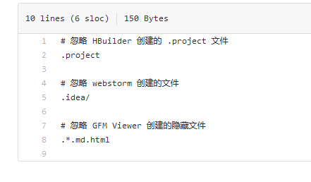

# .gitignore
在git项目管理中会遇到这样的情况，把没有必要的和不想上传的文件／文件夹。上传到了的代码仓库。想避免这个尴尬很简单，

### .gitignore 文件的使用步骤
- 打开 git bash；
- touch .gitignore  
//创建.gitignore 隐藏文件  

- [vim](vim.md) .gitignore        
//编辑  .gitignore 文件，加入想要忽略的文件。

如图所示：

- 如果添加 .gitignore 文件之前已经添加想要忽略的文件，那么后来添加的 .gitignore 文件时无法对之前添加的文件起作用的。那么怎么办呢？可以这样：
  - git pull [] []
  - git rm -r --cached .
  - git add .
  - git commit -m ""
  - git push [] []

