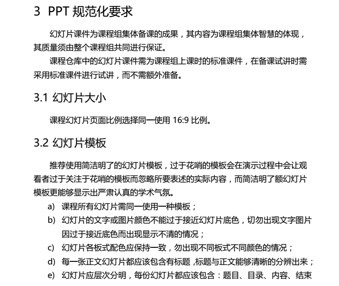
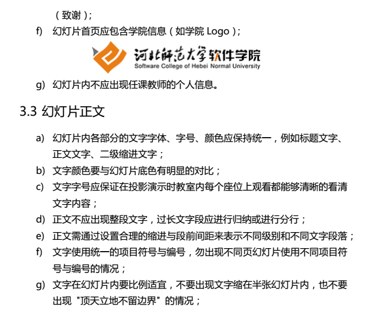
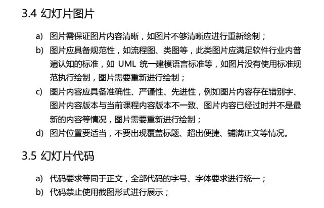
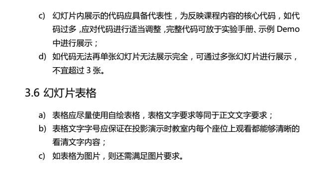

### 学院要求

## web（二）PPT制作规范

### 幻灯片大小

- 比例统一为 **16:9**

### 幻灯片模板

- 每个完整的 PPT 应包含：封面页，目录页，内容回顾，致谢结束页
- 每页幻灯片都包含学院的 logo

### 幻灯片的正文

- PPT 中所有中文都采用**微软雅黑**字体，间距是 **1.5** 倍
- 每页幻灯片的标题：红色，字号：**32**，居左
- 正文一级：绿色，字号：**28**，编号是一个**圆点**
- 正文二级：绿色，字号：**24**，编号是一个**横杠**
- 正文不出现整段文字，应进行分段或归纳
- 文字在幻灯片中的位置适中

### 幻灯片图片

- 图片**清晰**（请大家仔细检查）
- 图片应具备规范性
- 图片内容准确，严谨，先进

### 幻灯片代码

- **微软雅黑**，字号参考**24**号
- 禁止使用截图展示代码，**这里咱们需要重点修改，可以适当缩减代码**
- 代码过多时，需展示关键部分，其余可在 demo 中演示

### 幻灯片表格

- 文字要求和正文要求一致
- 如果是图片，则和图片要求一致

